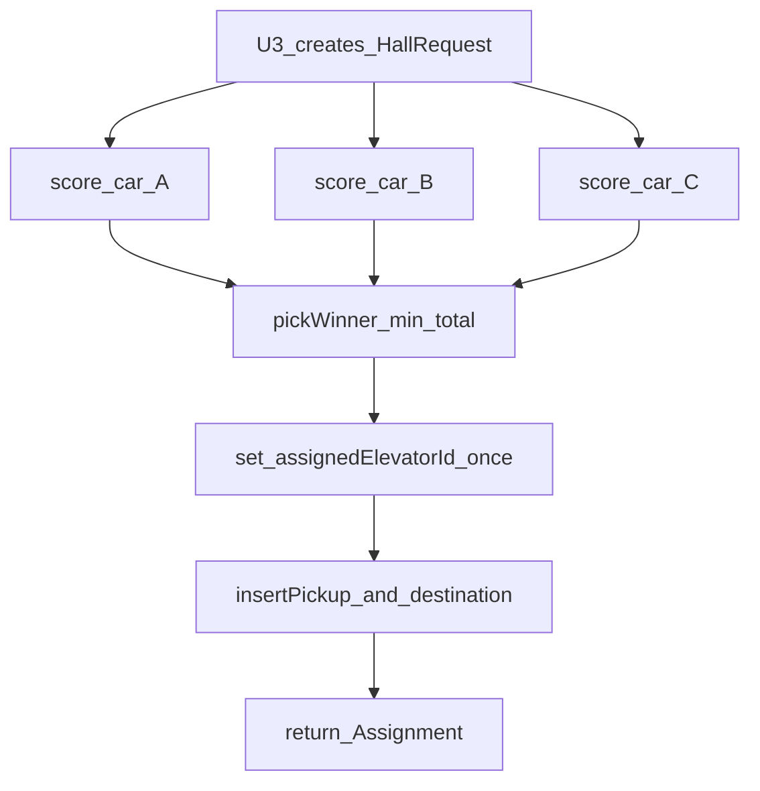

# Business Logic Model — dispatch-engine

**Unit**: U2  
**Answers**: Q1–Q7 all **A**  
**No UI** in this unit. Skip `frontend-components.md`.

## Module boundary

```
src/engine/     pure TypeScript, no React
tests/engine/   Vitest example tests + fast-check
```

U3 (`src/simulation`) creates requests, holds `now`, multiplies speed into `dt`, and calls engine functions. It must not reimplement scoring.

## Public API (from application design)

| Component | Methods |
|---|---|
| DispatchEngine | `assign(request, state) -> Assignment`, `evaluate(request, state) -> CostBreakdown`, `planStops(elevator, assignedRequests) -> Floor[]` |
| CostScorer | `score(request, elevator, now) -> CarCost`, `total(carCost) -> number`, `pickWinner(costs) -> ElevatorId` |
| StopQueueManager | `insertPickup`, `insertDestination`, `ensureApproachStops`, `nextStop`, `canReverse` |
| ElevatorStateMachine | `tick(elevator, dt)`, `board`, `alight` |

`evaluate` is a **pure view** of the same `score` + `pickWinner` path as `assign`. `assign` additionally writes `request.assignedElevatorId` and updates that car’s queue.

## Assign flow



Text alternative:

1. U3 creates a hall request (pickup, direction, destination, createdAt).
2. CostScorer scores A, B, and C against current WorldState.
3. pickWinner chooses the minimum total (tie A, then B, then C).
4. Assignment is locked on the request (never reassigned).
5. StopQueueManager inserts pickup (and destination) on the winning car.
6. Return Assignment with the same CostBreakdown the UI will show.

## Evaluate flow

`evaluate` repeats steps 2–3 only. It does not change queues or assignment. Used by the Dispatch Evaluation panel (U4) and by tests that check agreement with `assign`.

## Serve direction and reverse

Each `tick`:

1. If doors-open, count down dwell; then close.
2. If moving, advance `floor` toward `nextStop`.
3. On arrival, open doors (board/alight are called by U3 around this window).
4. After doors close: if `nextStop` exists in current direction, keep going; else if the opposite list has remaining stops and `canReverse`, reverse; else idle.

U3 must not reverse the car when `canReverse` is false.

## Data in / out

| In | Out |
|---|---|
| HallRequest + WorldState | Assignment / CostBreakdown |
| Elevator + dt | New Elevator (tick) |
| Elevator + passengers | New Elevator (board/alight) |

No network, no disk, no React.

## Error and edge cases

| Case | Behavior |
|---|---|
| Pickup equals car floor, idle winner | Doors open immediately; no move |
| All three totals equal | Car A |
| Request already assigned | `assign` is not called again (U3). `evaluate` may still run |
| Empty queues after last alight | status idle, direction null |
| Alight count > occupancy | Reject as invalid input (tests); not a boarding refuse |
| Floor would pass 1 or 10 | Clamp |

## Testable Properties (PBT-01) by component

### C-ENG-01 DispatchEngine

| Category | Property |
|---|---|
| Oracle | Selected id is the min-total car with documented tie-break |
| Invariant | `assign` and `evaluate` agree on selected id and all six factor columns |
| Invariant | Second conceptual assign is not performed (lock); tests call `assign` once |

### C-ENG-02 CostScorer

| Category | Property |
|---|---|
| Invariant | `waitingAgeCredit(now+dt) >= waitingAgeCredit(now)` for dt ≥ 0 |
| Invariant | Idle cars have reversePenalty 0 and directionCompatibility 0 |
| Oracle | `total` equals the documented arithmetic of the six fields |

### C-ENG-03 StopQueueManager

| Category | Property |
|---|---|
| Idempotence | Double insert of the same floor is a no-op |
| Invariant | `canReverse` is false while remaining stops exist in that direction |
| Easy verification | `nextStop` is always strictly ahead in the travel direction, or null |
| Stateful (PBT-06) | Random command sequences match a two-set model |

### C-ENG-04 ElevatorStateMachine

| Category | Property |
|---|---|
| Invariant | Floor stays in `[1, 10]` |
| Invariant | Occupancy ≥ 0 after valid board/alight |
| Invariant | No reverse while `canReverse` is false (tick respects the gate) |

### PBT-02

**N/A** — no serialization/encoding pair in U2.

Round-trip, commutativity of independent transforms, and induction are not primary for this unit except as covered above.

## Example-based scenarios (PBT-10, for code generation)

Must exist in addition to PBT:

- Three-way cost table matching the named weights (fixture)
- Compatible ahead pickup is inserted and extends the last stop
- Opposite-direction pickup does not reverse a car that still has current-direction stops
- Idle nearby car wins on distance when others are far
- Older request’s credit can beat a 1-floor distance gap at documented `WAITING_AGE_RATE`
- Engine module graph has no `react` import
