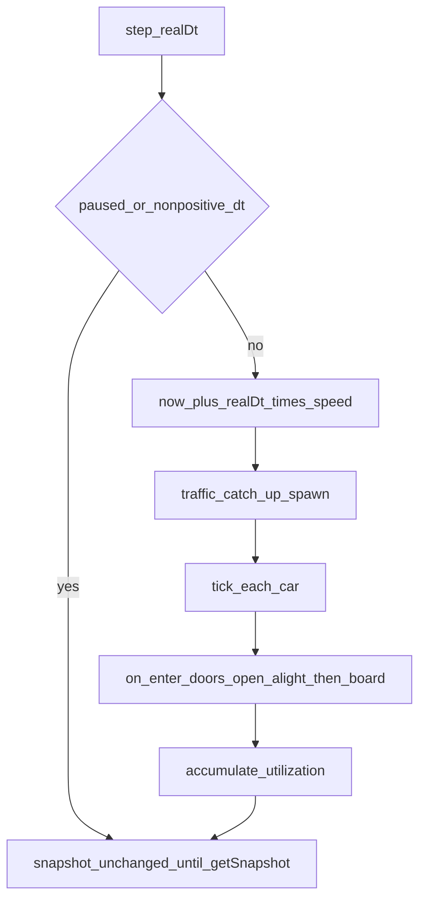
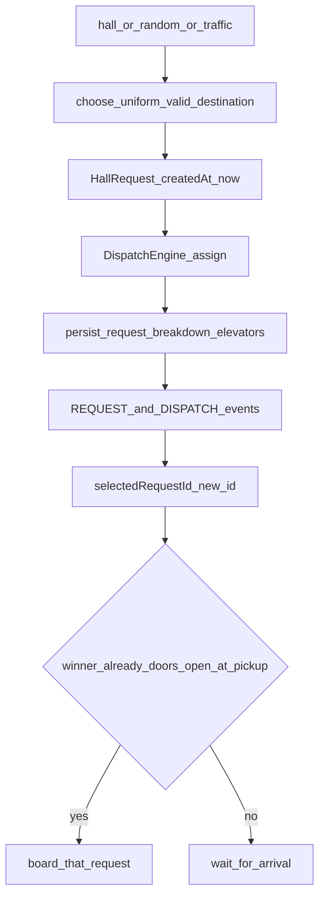

# Business Logic Model — simulation-runtime

**Unit**: U3  
**Answers**: Q1–Q7 all **A**  
**No UI** in this unit. Skip `frontend-components.md`. Dashboard stays on `sampleSnapshot` until U4.

## Module boundary

```
src/simulation/     TypeScript orchestrator, no React, no rAF
tests/simulation/   Vitest example tests + fast-check (PBT-01 properties below)
```

U3 calls U2. It must not reimplement scoring, queues, reverse, or `tick` physics.

## Public API

| Component | Methods |
|---|---|
| SimulationClock | Used internally: pause/resume/reset/setSpeed; `simDt` from `step` |
| TrafficGenerator | `setPreset`; spawn via debt inside `step` |
| MetricsCollector | Updated on pickup, dropoff, and busy time |
| EventLogStore | `append`, `filter`, `clear` (clear on reset) |
| SimulationService | `step(realDt)`, `getSnapshot()`, `clickHall`, `addRandomRequest`, `setTraffic`, `setSpeed`, `pause`, `resume`, `reset`, `selectRequest` |

Tests and (later) U4 call `step(realDt)`. U3 never starts a browser timer.

## Step flow



Text alternative:

1. If paused or `realDt <= 0`, return (no time, no spawn, no tick).
2. Add `realDt * speed` to `now`.
3. Catch up traffic spawns (each spawn is the + Add request path).
4. `tick` each car with `simDt`.
5. On enter `doors-open`, alight then board (Q5).
6. Add `simDt` to busy time for cars that are not idle.
7. Callers read `getSnapshot()` when they need a UI-ready object.

Spawn runs **before** `tick` so a brand-new idle same-floor assignment can open doors and board in the same step after `tick` (engine `assign` may already set `doors-open`; U3 still runs the enter-doors handler on that transition).

## Create-and-assign flow (hall, + Add request, traffic)



Text alternative:

1. Choose pickup / direction / uniform valid destination (Q3).
2. `assign` once; copy returned elevators and locked request into the world.
3. Log REQUEST and DISPATCH; select the new request for the evaluation panel.
4. If the winning car is already `doors-open` at the pickup floor, board immediately; otherwise wait for the next enter-`doors-open` at that floor.

## Door cycle

1. Compare each car’s status before and after `tick` (and after `assign`).
2. On enter `doors-open`: alight dest == this floor, then board assigned pickups at this floor.
3. Engine counts down `doorTimer` on later ticks and then moves or idles. U3 does not reverse cars; `tick` already respects `canReverse`.

## Data in / out

| In | Out |
|---|---|
| `realDt`, speed, paused | Updated `now`, cars, requests |
| Hall floor + direction | New request + assignment or no-op |
| `getSnapshot()` | UI `SimulationSnapshot` |

No network, no disk, no React.

## Error and edge cases

| Case | Behavior |
|---|---|
| Pause | Clock, cars, auto spawn frozen |
| Reset | Q1 initial world |
| Invalid hall | No-op |
| Catch-up cap | At most 20 auto spawns per `step` |
| Empty evaluation | Placeholder `"—"`, zeros, selected A |

## Testable Properties (PBT-01) by component

### C-SIM-02 SimulationClock

| Category | Property |
|---|---|
| Invariant | Paused `step` does not change `now` |
| Oracle | Running `Δnow = realDt * speed` for `realDt > 0` |

### C-SIM-03 TrafficGenerator

| Category | Property |
|---|---|
| Invariant | Off ⇒ no auto requests |
| Oracle | Catch-up count vs interval and elapsed sim time (capped) |
| Invariant | Pause ⇒ no auto requests |

### C-SIM-04 MetricsCollector

| Category | Property |
|---|---|
| Invariant | `completedTrips` equals number of alights |
| Easy verification | `averageWait` is 0 when `completedTrips` is 0 |

### C-SIM-05 EventLogStore

| Category | Property |
|---|---|
| Invariant | Reset clears events |
| Easy verification | Formatted time matches `HH:MM:SS.mmm` from `at` |

### C-SIM-01 SimulationService

| Category | Property |
|---|---|
| Invariant | Created destinations are valid for direction |
| Invariant | Occupancy ≥ 0 |
| Idempotence | Double `reset` |
| Stateful (PBT-06) | Command sequences vs a model of `now`, pause, and auto-spawn count |
| Easy verification | `getSnapshot` always has three elevator rows and `occupancyMax` 8 |

### PBT-02

**N/A** — no serialization/encoding pair in U3.

## Example-based scenarios (PBT-10, for code generation)

Must exist in addition to PBT:

- Hall ↑ on floor 3 creates a dest in 4–10 and assigns a car
- Invalid ↓ on floor 1 is a no-op
- + Add request uses the same assign path as a hall click
- Traffic Off: many `step`s add no auto requests
- Busy catch-up: `step(9)` at 1x from a clean debt spawns three requests (3+3+3, remainder 0) unless capped
- Pause: `step` does not move cars or spawn
- Reset returns cars to idle floor 1 and empty log
- Enter doors-open: occupancy drops on alight then rises on board in that order
- `getSnapshot` event time at `now = 14.2` is `00:00:14.200`
- Simulation module graph has no `react` import
