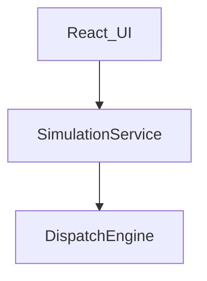

# Application Design

**Product**: Elevator Dispatch Simulator (educational POC)  
**Visual target**: `aidlc-docs/inception/requirements/ui-mockup.jpg` **1:1**  
**First increment**: Static shell of this design (sample snapshot). No live tick or dispatcher.

This document consolidates `components.md`, `component-methods.md`, `services.md`, and `component-dependency.md`.

---

## 1. Architectural style

- **Monolithic SPA** (Vite + React + TypeScript)
- **Three modules**: `src/ui`, `src/simulation`, `src/engine`
- **Pattern**: UI is a view of `SimulationSnapshot`. SimulationService orchestrates. Engine is a pure library (testable, including fast-check later)
- **No backend**, no shared database

---

## 2. UI layout (1:1 with the mockup)

Desktop only. Light-gray page background. White panels with light border and subtle shadow. Elevator colors: **A blue**, **B orange**, **C purple**.

**Header (full width)**
- Left: icon + **Elevator Dispatch Simulator** + **10 Floors · 3 Elevators**
- Center: **Algorithm:** dropdown = Cost-Based Collective Control
- Right: **● Running** (green) and speed **1x** chevron (same speed as the control bar)

**Main row**
- **Left (flex grow)**: Building visualizer (floors 1–10, 1 at bottom; Hall Calls; shafts A B C; footer “Click ↑ or ↓ to create a passenger”)
- **Under visualizer**: Pause (filled blue), Reset, + Add request, Traffic: Normal, speed chips 0.5x / **1x** / 2x / 5x
- **Right (fixed ~ two-panel width)**:
  - Row 1: **Active Requests** | **Dispatch Evaluation - Request #018**
  - Row 2: **Elevators** table (occupancy `2 / 8` style)
  - Row 3: **Performance** KPIs + utilization bars 0–100%

**Footer (full width)**: **Event Log** + Filter All Events; timestamped pills REQUEST / DISPATCH / ELEVATOR / PASSENGER

**Scaffold sample data** should match the screenshot’s *kinds* of content (moving A `4 → 5`, B doors open with 2 passengers, C `7 → 6`, highlighted hall chips, evaluation totals, log lines). Numbers may be fixtures.

---

## 3. Component catalog

See `components.md` for full responsibilities.

| ID | Name | Layer |
|---|---|---|
| C-UI-01..12 | AppShell through EventLogPanel | UI |
| C-SIM-01 | SimulationService | Simulation (orchestrator) |
| C-SIM-02..05 | Clock, Traffic, Metrics, EventLog | Simulation |
| C-ENG-01..04 | DispatchEngine, CostScorer, StopQueueManager, ElevatorStateMachine | Engine |

---

## 4. Methods

See `component-methods.md`. Engine/simulation signatures are for later units. Scaffold only needs UI props and a `sampleSnapshot`.

---

## 5. Service

See `services.md`. **S-01 SimulationService** is the only service. It is the only module allowed to call `DispatchEngine.assign` / `evaluate`.

---

## 6. Dependencies

See `component-dependency.md`. Engine never imports React or simulation.

---

## 7. Story mapping (design)

| Stories | Components |
|---|---|
| US-S1 | All C-UI-* with sample snapshot; empty engine/simulation stubs |
| US-D1–D6 | C-ENG-* |
| US-L1–L7 | C-SIM-* + C-UI visualizer/controls |
| US-O1–O5 | C-UI-08..12 + MetricsCollector + EventLogStore |

---

## 8. Decisions taken in this stage

1. Match the mockup **1:1**, including algorithm dropdown and occupancy **n / 8**.
2. Boarding is still **not refused**; `8` is the occupancy denominator on screen (requirements D3/D9 updated).
3. Header speed control and control-bar speed chips show the same `Speed` value.
4. Dispatch Evaluation is a **view of engine `evaluate()`**, never a second scoring path.
5. Scaffold unit skips Functional Design; it implements C-UI-* layout only.

---

## 9. Consistency check

- Every mockup region has a UI component: yes
- Engine isolated: yes
- Algorithm dropdown present: yes (MVP: one option)
- Occupancy column `n / 8`: yes
- PBT-relevant methods identified on scorer/queue/assign: yes (deferred to Functional Design)
- Security/infra: N/A (POC)
