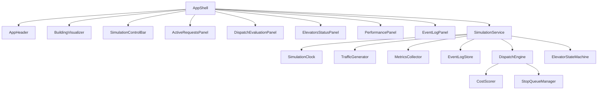

# Component Dependencies

## Rules
- `engine` depends on nothing in `simulation` or `ui`
- `simulation` depends on `engine` only
- `ui` depends on snapshot **types** (from engine or a shared types file) and, later, on SimulationService
- Scaffold: `ui` may depend on a `sampleSnapshot` fixture only

## Dependency matrix

| From \ To | AppShell | UI panels | SimulationService | Clock / Traffic / Metrics / Log | DispatchEngine | Scorer / Queue / SM |
|---|---|---|---|---|---|---|
| AppShell | — | uses | later | no | no | no |
| UI panels | parent | — | no (via shell) | no | no | no |
| SimulationService | no | no | — | uses | uses | no |
| Clock / Traffic / Metrics / Log | no | no | used by | sibling | no | no |
| DispatchEngine | no | no | used by | no | — | uses |
| Scorer / Queue / SM | no | no | no | no | used by | — |

## Communication
- **UI → SimulationService**: method calls from click handlers (later unit)
- **SimulationService → Engine**: in-process function calls
- **Engine → UI**: none. UI reads snapshot fields (`costBreakdown`, queues, floors)
- **Data flow**: events append to EventLogStore; snapshot is a read model built each tick (or on demand)

## Diagram

Text alternative:

- AppShell composes all mockup regions and (later) SimulationService.
- SimulationService uses Clock, Traffic, Metrics, EventLog, DispatchEngine, ElevatorStateMachine.
- DispatchEngine uses CostScorer and StopQueueManager.
- No arrow from engine to UI.

## Layout vs dependency

The 1:1 visual layout is composition inside AppShell, not extra runtime coupling. Right column is a 2-column grid (Active Requests | Dispatch Evaluation), then Elevators, then Performance, then a full-width Event Log.
