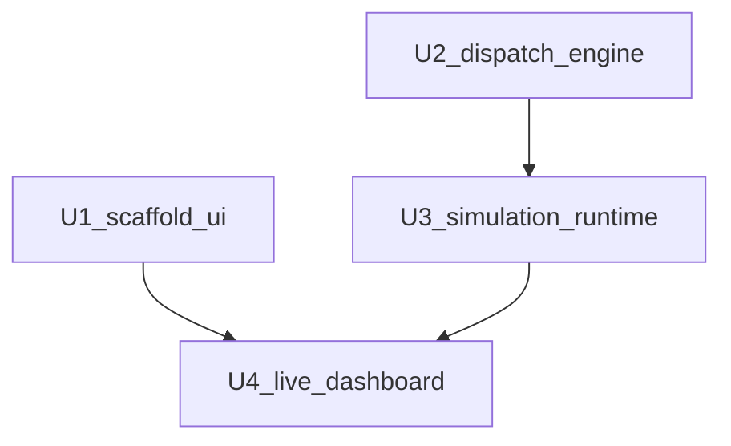

# Unit Dependencies

All units ship in **one npm package**. Dependencies are **source/module** order, not network.

## Matrix

| Unit | Depends on | Why |
|---|---|---|
| U1 scaffold-ui | — | Tooling and static UI. May contain empty `src/engine` and `src/simulation` barrels. |
| U2 dispatch-engine | — | Pure library. Must not import `ui` or `simulation`. |
| U3 simulation-runtime | U2 | Tick and assignment call DispatchEngine. |
| U4 live-dashboard | U1, U3 | Replaces sample snapshot; calls SimulationService. U3 already uses U2. |

## Construction sequence

1. **U1** — first increment; stop for user continue
2. **U2** — engine tests must pass without React
3. **U3** — simulation tests; can use a fake clock
4. **U4** — wire UI; browser check against the mockup

## Integration

- **Shared resource**: `SimulationSnapshot` type from engine
- **Communication**: in-process function calls only
- **Rollback**: git revert (POC)

Text alternative:

- U1 and U2 have no unit dependencies
- U3 depends on U2
- U4 depends on U1 and U3
