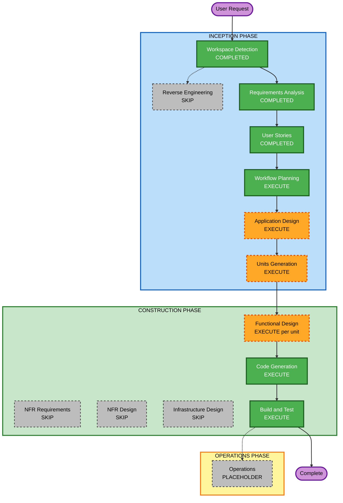

# Execution Plan

## Detailed Analysis Summary

### Transformation Scope (Brownfield Only)
N/A — greenfield.

### Change Impact Assessment
- **User-facing changes**: Yes — new desktop simulator UI (mockup + later live controls)
- **Structural changes**: Yes — new SPA with UI, simulation controller, and pure TypeScript dispatch engine
- **Data model changes**: Yes — in-memory elevator, request, passenger, and simulation state (no database)
- **API changes**: No — no backend HTTP API
- **NFR impact**: Limited — local POC; PBT (fast-check) for the engine; no production hosting, CI, or DR

### Component Relationships (Brownfield Only)
N/A — greenfield.

### Risk Assessment
- **Risk Level**: Medium for the full MVP (dispatcher correctness, concurrent requests); Low for the first increment (static shell)
- **Rollback Complexity**: Easy — git revert, local only
- **Testing Complexity**: Simple for scaffold; Complex for dispatcher (example + PBT)

### Delivery constraint
User requirement: **scaffold first; do not implement the full app in one go.** Construction will generate **one unit at a time**. The first code increment is **US-S1 only** (static dashboard). Later units wait for an explicit continue.

---

## Workflow Visualization

### Mermaid Diagram



### Text Alternative

```
INCEPTION
- Workspace Detection: COMPLETED
- Reverse Engineering: SKIP (greenfield)
- Requirements Analysis: COMPLETED
- User Stories: COMPLETED
- Workflow Planning: EXECUTE (this document)
- Application Design: EXECUTE
- Units Generation: EXECUTE

CONSTRUCTION (first unit = scaffold / US-S1 only)
- Functional Design: EXECUTE for engine/simulation units; SKIP for scaffold unit
- NFR Requirements: SKIP (stack already chosen; POC)
- NFR Design: SKIP (NFR Requirements skipped)
- Infrastructure Design: SKIP (no cloud, no backend)
- Code Generation: EXECUTE (always)
- Build and Test: EXECUTE (always)

OPERATIONS: PLACEHOLDER
```

---

## Phases to Execute

### 🔵 INCEPTION PHASE
- [x] Workspace Detection (COMPLETED)
- [x] Reverse Engineering (SKIPPED — greenfield)
- [x] Requirements Analysis (COMPLETED)
- [x] User Stories (COMPLETED)
- [x] Workflow Planning (this plan; awaiting approval)
- [ ] Application Design — EXECUTE
  - **Rationale**: New UI, simulation controller, and dispatch engine. Need component boundaries, methods, and dependencies so `src/ui`, `src/simulation`, and `src/engine` match the design. Not a change inside an existing component.
- [ ] Units Generation — EXECUTE
  - **Rationale**: Complex dispatcher, in-memory models, and a scaffold-first split. Units map stories to increments so construction does not build the full MVP in one pass. Proposed shape (finalized in that stage): Scaffold (US-S1), Dispatch Engine (US-D*), Simulation (US-L*), Dashboard/Observability (US-O* + live wiring).

### 🟢 CONSTRUCTION PHASE
- [ ] Functional Design — EXECUTE (per unit, not for scaffold)
  - **Rationale**: Dispatcher and simulation have state machines and scoring rules. **Scaffold unit skips Functional Design** (static layout, no business logic). Later units execute it, including PBT-01 property lists on US-D1, D2, D3, D5, D6.
- [ ] NFR Requirements — SKIP
  - **Rationale**: React / TypeScript / Vite / Vitest / npm / global CSS / fast-check already decided in requirements. No production performance, security, or scale targets. PBT-09 is already recorded (fast-check). User may add this stage back if they want a separate NFR artifact.
- [ ] NFR Design — SKIP
  - **Rationale**: NFR Requirements skipped; no NFR patterns to incorporate.
- [ ] Infrastructure Design — SKIP
  - **Rationale**: No cloud, no IaC, no backend. Local `npm run dev` only (RESILIENCY-02/04/08 N/A).
- [ ] Code Generation — EXECUTE (ALWAYS)
  - **Rationale**: First unit: Vite + React + TypeScript + Vitest + folders + static mockup shell (US-S1 / FR-S1–S6). No live animation or dispatcher in that increment.
- [ ] Build and Test — EXECUTE (ALWAYS)
  - **Rationale**: After units that have been coded; for the first increment this is install, `npm run dev`, and `npm test` (placeholder/config).

### 🟡 OPERATIONS PHASE
- [ ] Operations — PLACEHOLDER
  - **Rationale**: No production deploy for this POC.

---

## Construction sequence (after Units Generation)

1. **Unit: Scaffold** — skip FD / NFR / infra; Code Generation of static shell; then pause for user continue.
2. **Unit: Dispatch engine** — Functional Design (PBT-01) + Code Generation + tests (Vitest + fast-check).
3. **Unit: Simulation** — Functional Design + Code Generation (clock, traffic, state machine).
4. **Unit: Live UI / observability** — wire mockup to live state; skip or light FD.

Exact unit names and story map are produced in Units Generation. You can override this split.

---

## Package Change Sequence (Brownfield Only)
N/A — single greenfield npm app at workspace root.

## Estimated Timeline
- **Remaining gated stages before first code**: Application Design, Units Generation, then scaffold Code Generation (planning + generation)
- **First working deliverable**: static dashboard matching the mockup (with documented deviations)
- **Full MVP**: later units, only after you continue past the scaffold

## Success Criteria
- **Primary Goal**: Scaffolded Vite app whose UI shell matches the mockup; later, a testable cost-based dispatcher with a live visualizer
- **Key Deliverables**: Application design, unit map, then `src/` scaffold (US-S1)
- **Quality Gates**: User approval at each stage; scaffold has no live dispatcher; engine remains React-free when implemented

## Extension notes
- Security: skipped (opt-out)
- Resiliency: enabled; production/DR/CI/infra remain N/A; Infrastructure Design skip is consistent
- PBT: full; properties documented in Functional Design for engine unit; tests in that unit’s Code Generation
