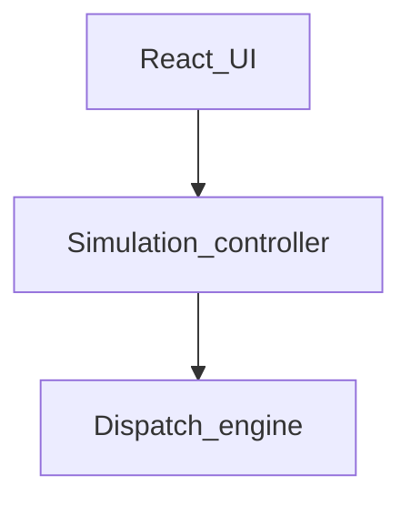

# Requirements — Elevator Dispatch Simulator

## Intent Analysis

- **User request**: Build a browser-based elevator simulator whose main focus is the scheduling “brain,” supported by a visual UI. Follow AI-DLC. Scaffold first; do not implement the full app in one increment. Source plan: `PROJECT_PLAN.md`. Visual target: `aidlc-docs/inception/requirements/ui-mockup.jpg`.
- **Request type**: New project (greenfield proof of concept)
- **Scope estimate**: System-wide single-page app (UI + simulation controller + pure TypeScript dispatch engine). No backend.
- **Complexity estimate**: Moderate-to-complex algorithm and animation; first construction increment is a static scaffold only.
- **Requirements depth**: Standard (POC with a clear mockup; production hosting out of scope)

## Product Context

This is an **educational proof of concept**, not software for controlling physical elevators, and not a production-hosted workload.

A learner should see how three elevators handle many simultaneous hall calls: assignment scores, stop queues, movement, and wait metrics.

## Decisions (from plan, mockup, and answers)

| ID | Decision |
|---|---|
| D1 | Fixed building: 10 floors, 3 elevators (A, B, C). Floors numbered 1–10, floor 1 at the bottom. |
| D2 | Elevator colors: A blue, B orange, C purple. |
| D3 | No passenger capacity limit for boarding (cars do not refuse). Occupancy **display** is `n / 8` to match the mockup 1:1 (Application Design, 2026-08-31). |
| D4 | No waiting sprites on floors. Hall ↑/↓ are color-coded by assigned car. Cars show occupancy badge and a floor-to-floor label while moving. |
| D5 | Hall ↑/↓ creates a passenger. Destination is assigned automatically (random valid floor in the requested direction). |
| D6 | **+ Add request** creates one extra request the same way as a hall click (random floor, direction, auto destination). |
| D7 | Traffic presets: Off / Normal / Busy. |
| D8 | Speed: 0.5x, 1x, 2x, 5x. Pause and Reset. |
| D9 | MVP algorithm: Cost-Based Collective Control only. **Header shows the Algorithm dropdown** to match the mockup 1:1; other strategies are not implemented (disabled or single option). |
| D10 | Cost weights are named constants in a config module. Dispatch Evaluation panel shows factor scores and the selected car. |
| D11 | Desktop-only layout matching the mockup. |
| D12 | Metrics: average wait, longest wait, average journey, completed trips, utilization bars. |
| D13 | Event log with type filter (REQUEST / DISPATCH / ELEVATOR / PASSENGER / All). |
| D14 | Tech: React, TypeScript, Vite, Vitest, npm, global CSS under `src/styles/`. No backend or database. |
| D15 | First increment: Vite app + Vitest + folders (`engine`, `simulation`, `ui`) + README + static layout shell. No live animation, no dispatcher logic, no extra domain-type increment in the scaffold. |
| D16 | Security baseline: skipped. Resiliency baseline: enabled, with POC N/A for production hosting/DR/CI. PBT: full enforcement. Framework: fast-check + Vitest. |

## Mockup fidelity

**Target**: `aidlc-docs/inception/requirements/ui-mockup.jpg` **1:1** (confirmed Application Design, 2026-08-31).

Include the algorithm dropdown, occupancy `n / 8`, header Running + 1x control, control-bar speed segmented control, all four right-hand panels, and the event log as drawn. Boarding is still not refused (D3); `8` is the occupancy denominator on screen.

## Architecture Constraint

Dispatch logic must stay independent of React so it can be unit-tested and later swapped.



Text alternative:

- React UI talks to the simulation controller (clock, traffic, metrics, animation).
- Simulation controller talks to a pure TypeScript dispatch engine (state machine, scoring, stop queues, assignment).
- No server, no database.

```
React UI
   |
   v
Simulation controller (clock, traffic, metrics)
   |
   v
Pure TypeScript dispatch engine
```

## Functional Requirements

### First increment (scaffold only)

- **FR-S1**: Create a Vite + React + TypeScript app installable with npm.
- **FR-S2**: Configure Vitest so dispatcher tests can be added later (`npm test`).
- **FR-S3**: Create folders `src/engine`, `src/simulation`, `src/ui`, and `src/styles` with empty module entry points.
- **FR-S4**: Render a **static** desktop shell that matches the mockup layout: header, shaft visualizer, hall ↑/↓, controls (Pause, Reset, + Add request, Traffic, speed), Active Requests, Dispatch Evaluation, Elevators, Performance, event log.
- **FR-S5**: Static shell uses sample labels and the A/B/C color language. Controls do not need to work. Elevators do not animate. Dispatcher is not implemented.
- **FR-S6**: README documents how to install, run, and test.

### Later increments (product MVP — not this scaffold)

- **FR-1**: Simulate 10 floors and three independent cars with states idle, moving, and doors open.
- **FR-2**: Animate cars between floors. Positions may be fractional while moving (for example 4.7).
- **FR-3**: Hall ↑ on floors 1–9 and hall ↓ on floors 2–10 create a request. Destination is a random valid floor in that direction, chosen at creation.
- **FR-4**: Multiple requests may exist at once. Hall buttons show assignment by car color and letter.
- **FR-5**: **+ Add request** inserts one random request as in FR-3.
- **FR-6**: Traffic Off / Normal / Busy continuously generates requests while the simulation is running (Off generates none).
- **FR-7**: Pause freezes the clock. Reset returns cars, requests, metrics, and log to the initial state.
- **FR-8**: Speed multipliers 0.5x, 1x, 2x, 5x scale simulation time.
- **FR-9**: Dispatcher assigns each new request to the lowest-cost car. Cost factors: distance to pickup, already moving toward the passenger, direction match, scheduled stop count, reverse penalty, waiting-age credit.
- **FR-10**: A car continues stops in its current direction, picks up compatible passengers along the route, and reverses only after that directional queue is empty.
- **FR-11**: Idle cars prefer nearby requests. Waiting-age credit must prevent starvation of old requests.
- **FR-12**: On a stop the car opens doors, dwells briefly, then continues. Occupancy count updates on board/alight. No capacity refusal.
- **FR-13**: Dispatch Evaluation shows the latest (or selected) request’s per-car factor scores and the selected car.
- **FR-14**: Active Requests lists floor, direction, wait time, and assigned car.
- **FR-15**: Elevators table lists status, floor, next stop, stop queue, occupancy as `n / 8`, utilization.
- **FR-16**: Performance cards: average wait, longest wait, average journey, completed trips, plus utilization bars per car.
- **FR-17**: Event log records REQUEST, DISPATCH, ELEVATOR, and PASSENGER events with timestamps and a type filter.
- **FR-18**: The engine is pure TypeScript with no React imports, covered by example-based Vitest tests and property-based tests (fast-check).

## Non-Functional Requirements

- **NFR-1**: Desktop layout only. No mobile breakpoint requirement for the POC.
- **NFR-2**: Runs locally via `npm run dev`. No production hosting, CDN, or multi-region topology.
- **NFR-3**: No persistent storage. Reset or full page reload is sufficient recovery.
- **NFR-4**: Dispatcher scoring and assignment must be deterministic for a given state (testable).
- **NFR-5**: Global CSS in `src/styles/` (not CSS-in-JS). Animation uses regular CSS.
- **NFR-6**: PBT uses fast-check, shrinking enabled, seed logged on failure. PBT complements example-based tests (PBT-10).
- **NFR-7**: No CI pipeline for this POC. Tests run locally.
- **NFR-8**: Workload criticality: **Low**. Unavailability has no business or regulatory impact (RESILIENCY-01).

## Dispatcher Behavior (product MVP)

Each request includes pickup floor, requested direction, destination floor, creation time, and assignment status.

Cost scoring (lowest wins) uses:

- Distance from pickup
- Already moving toward the passenger
- Direction match
- Number of scheduled stops
- Reverse penalty
- Waiting-age credit

Engine rules:

1. Serve the current direction to completion.
2. Pick up compatible passengers on the route.
3. Reverse only when that directional queue is empty.
4. Prefer nearby requests when idle.
5. Age old requests so they are not starved.
6. Open doors, dwell, continue.

## Delivery Sequence (after scaffold)

Aligned with `PROJECT_PLAN.md`, adjusted for D15:

1. Scaffold (this first construction increment).
2. Domain types and dispatcher interfaces (next increment; not in scaffold).
3. Dispatcher implementation and tests (example + PBT).
4. Simulation clock and elevator state machine.
5. Live visualizer and request controls.
6. Traffic presets and metrics.
7. Scenario tests: congestion, idle cars, reverse, starvation.
8. UI polish and algorithm notes.

## Extension Configuration

| Extension | Enabled | Notes |
|---|---|---|
| Security Baseline | No | POC; skip all SECURITY rules |
| Resiliency Baseline | Yes | Directional; production hosting/DR/CI recorded as N/A |
| Property-Based Testing | Yes (full) | fast-check + Vitest. Property list in Functional Design (PBT-01) |

## Resiliency decisions (POC)

| Rule | Decision |
|---|---|
| RESILIENCY-01 | Single SPA, Low criticality, no external dependencies |
| RESILIENCY-02 | N/A — no production hosting, no persistent data, no RTO/RPO |
| RESILIENCY-03 | Exempt — educational POC, no formal change management |
| RESILIENCY-04 | N/A — no CI, no production deploy, no canary/blue-green. Local git revert if needed |
| RESILIENCY-08 | N/A — no cloud topology |
| RESILIENCY-15 | N/A — no on-call. Browser console + in-app event log |

Rules that assume production compute, load balancers, backups, or multi-zone data stores are **N/A** for this client-only POC (RESILIENCY-05 through RESILIENCY-14 as they apply to deployed cloud workloads). In-app metrics and the event log are the observability surface for the simulator itself, not an operations stack.
